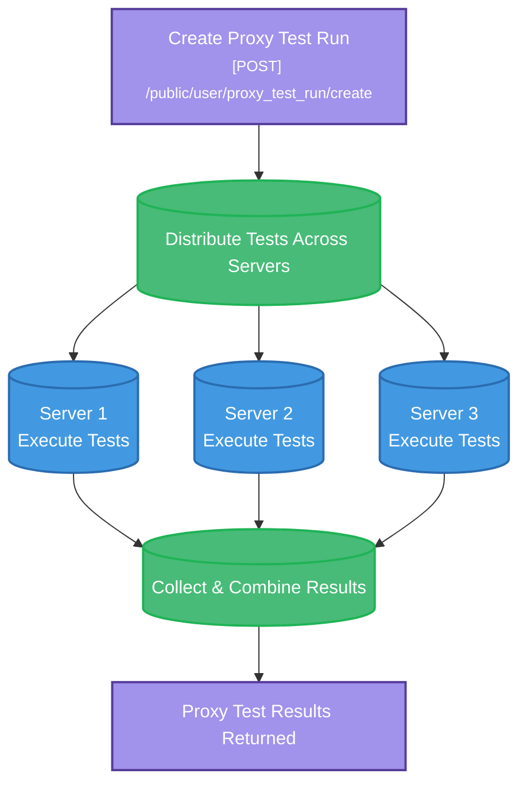

In an increasingly interconnected world, measuring proxy performance across different regions is critical. Our global infrastructure spans the United States, Europe, and Asia, allowing you to test your proxies from multiple vantage points. This way, you gain a clear understanding of real-world latency and reliability, ensuring that your users experience consistently high performance, no matter where they are located.

Below you can see how the Ping Proxies API distributes proxy tests across multiple servers and returns combined results.
The Python script example shows how to simply create a test run for a single proxy.

## What happens when you create a proxy tester? 


## Example Python Script

```python
import requests
import sys
# API credentials
API_PRIVATE_KEY = "your_private_key"
API_PUBLIC_KEY = "your_public_key"
BASE_URL = "https://api.pingproxies.com/1.0/public/user"

# Headers
headers = {
  "X-API-Public-Key": API_PUBLIC_KEY,
  "X-API-Private-Key": API_PRIVATE_KEY,
  "Content-Type": "application/json"
}
# Hardcoded proxy and test configuration

PROXY_STRING = "192.168.1.100:8080:username:password"  # Replace with your actual proxy
TARGET_URL = "https://pingproxies.com"
TEST_SERVER_ID = "newyork-3-digitalocean-proxytester-1"  # Replace with actual server ID

# Create the test payload
payload = {
    "proxies": [{"proxy_string": PROXY_STRING}],
    "proxy_tester_server_id": [TEST_SERVER_ID],
    "urls": [TARGET_URL],
}
try:
    response = requests.post(f"{BASE_URL}/proxy_test_run/create", json=payload, headers=headers)
    if response.status_code != 200:
        print(f"❌ Error: {response.status_code}")
        print(f"Response: {response.text}")
        sys.exit(1)

    result = response.json()
    print("\n✅ Proxy test created successfully!")
    print(f"Response: {result}")

    # Extract and display key results
    if "data" in result:
        for run_id, test_data in result["data"].items():
            if "results" in test_data:
                for test_result in test_data["results"]:
                    status_code = test_result.get("proxy_test_result_status_code", "N/A")
                    response_time = test_result.get("proxy_test_result_response_time", "N/A")
                    city = test_result.get("proxy_tester_proxy_city_name", "N/A")
                    country = test_result.get("proxy_tester_proxy_country_id", "N/A")
                    print(f"\nTest Results:")
                    print(f"Status Code: {status_code}")
                    print(f"Response Time: {response_time}ms")
                    print(f"Location: {city}, {country}")

except Exception as e:
    print(f"❌ Unexpected error: {e}")
```
<Warning>
  **Rate Limit** API users can create a maximum of `5000` proxy_test_run sessions per day through the API by standard. Contact our support team with justification if you would like to test more proxies than this.
</Warning>

## Usage Notes

- **Multi-Location Testing**: Tests are executed from multiple geographic locations to verify proxy performance globally
- **Performance Metrics**: Response times are measured to help identify performance/reliability issues
- **Geographic Accuracy**: Test results include both proxy exit location and test server location for geographic validation
- **Batch Processing**: Multiple proxies can be tested simultaneously for efficiency
- **Result Sharing**: Test results can be shared securely with password protection
- **Server Selection**: Choose specific test servers or let the system automatically select the closest one
- **Authentication Testing**: Proxy authentication is validated as part of the testing process
- **Rate Limit**: API users can run a maximum of 5000 tests per day through the API by standard. Contact our support team with justification if you would like to test more proxies than this.

<Warning>
  **Rate Limit** API users can create a maximum of `5000` proxy_test_run sessions per day through the API by standard. Contact our support team with justification if you would like to test more proxies than this.
</Warning>

## Best Practices

- **Test Server Selection**: Use test servers in regions where you plan to use the proxies
- **URL Variety**: Test against different types of websites (search engines, APIs, content sites) to ensure broad compatibility
- **Regular Testing**: Implement regular proxy testing to maintain service quality
- **Performance Monitoring**: Monitor response times to identify degraded proxies before they impact your operations
- **Geographic Validation**: Verify that proxy exit locations match your targeting requirements
