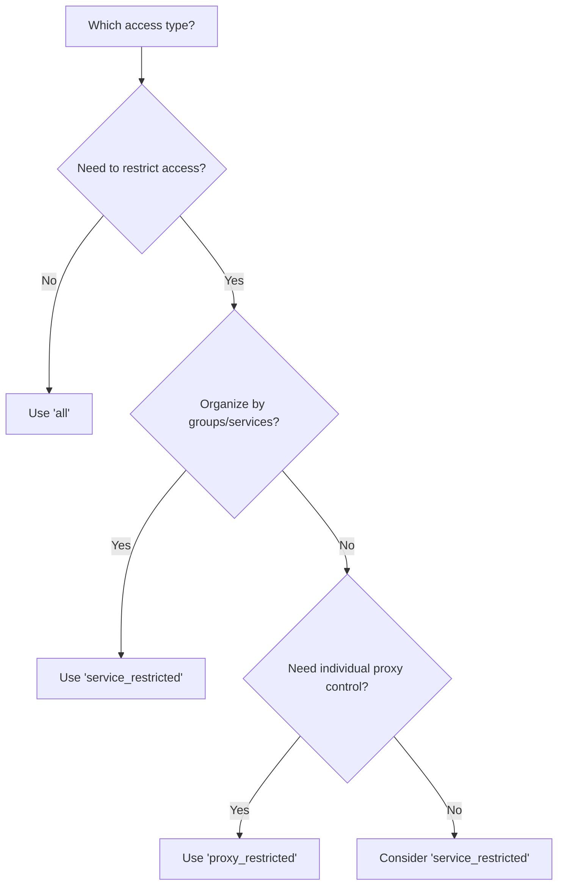

Proxy User Access Control allows you to restrict which proxies a proxy user can access. This is essential for organizing teams, managing customer access in reselling scenarios, and implementing security policies.

## Access Control Model

Access control in Ping Proxies uses a two-part system:

1. **`proxy_user_access_type`** - Set on the Proxy User object
2. **Proxy User ACL entries** - Individual permission grants

### The Three Access Types

#### 1. Unrestricted Access (`"all"`)

**Default setting.** The proxy user can access all proxies in your account.

```json
{
  "proxy_user_id": "admin_user",
  "proxy_user_access_type": "all"
}
```

**Best for:**
- Admin or internal users
- Development and testing
- Small teams with full proxy access

**ACL requirements:** None - no ACL entries needed

---

#### 2. Service-Restricted Access (`"service_restricted"`)

The proxy user can only access proxies within specific services. You grant access by creating Proxy User ACL entries with `service_id`.

```json
{
  "proxy_user_id": "seo_team",
  "proxy_user_access_type": "service_restricted"
}
```

Then create ACL entries to grant service access:

```json
{
  "proxy_user_id": "seo_team",
  "service_id": "API-SEO-POOL-001"
}
```

**Best for:**
- Department or team segregation (Marketing, SEO, Research teams)
- Organizing proxies by purpose (Social media, Web scraping, Ad verification)
- Multi-tenant scenarios where each customer gets specific services

**ACL requirements:** At least one ACL entry with `service_id`

---

#### 3. Proxy-Restricted Access (`"proxy_restricted"`)

The proxy user can only access specific individual proxies. You grant access by creating Proxy User ACL entries with `proxy_id`.

```json
{
  "proxy_user_id": "customer_123",
  "proxy_user_access_type": "proxy_restricted"
}
```

Then create ACL entries for each proxy:

```json
{
  "proxy_user_id": "customer_123",
  "proxy_id": "550e8400-e29b-41d4-a716-446655440001"
}
```

**Best for:**
- Reselling individual proxies to end customers
- Maximum security with fine-grained control
- Dedicated proxy assignments

**ACL requirements:** At least one ACL entry with `proxy_id`

## Decision Tree: Which Access Type Should I Use?



**Quick guide:**
- **Full access needed?** → Use `"all"`
- **Organize by teams/services?** → Use `"service_restricted"`
- **Control individual proxies?** → Use `"proxy_restricted"`

## Implementation Workflow

### Setting Up Service-Restricted Access

**Step 1:** Create the proxy user with service-restricted access type

```bash
curl --request POST \
  --url 'https://api.pingproxies.com/1.0/public/user/proxy_user/create' \
  --header 'Content-Type: application/json' \
  --header 'X-API-Public-Key: your_public_key' \
  --header 'X-API-Private-Key: your_private_key' \
  --data '{
    "proxy_user_id": "seo_team",
    "proxy_user_password": "securepass123",
    "proxy_user_access_type": "service_restricted"
  }'
```

**Step 2:** Grant access to services by creating ACL entries

```bash
curl --request POST \
  --url 'https://api.pingproxies.com/1.0/public/user/proxy_user_acl/create' \
  --header 'Content-Type: application/json' \
  --header 'X-API-Public-Key: your_public_key' \
  --header 'X-API-Private-Key: your_private_key' \
  --data '{
    "proxy_user_id": "seo_team",
    "service_id": "API-SEO-POOL-001"
  }'
```

Repeat Step 2 to grant access to additional services.

### Setting Up Proxy-Restricted Access

**Step 1:** Create the proxy user with proxy-restricted access type

```bash
curl --request POST \
  --url 'https://api.pingproxies.com/1.0/public/user/proxy_user/create' \
  --header 'Content-Type: application/json' \
  --header 'X-API-Public-Key: your_public_key' \
  --header 'X-API-Private-Key: your_private_key' \
  --data '{
    "proxy_user_id": "customer_123",
    "proxy_user_password": "securepass456",
    "proxy_user_access_type": "proxy_restricted"
  }'
```

**Step 2:** Grant access to individual proxies

```bash
curl --request POST \
  --url 'https://api.pingproxies.com/1.0/public/user/proxy_user_acl/create' \
  --header 'Content-Type: application/json' \
  --header 'X-API-Public-Key: your_public_key' \
  --header 'X-API-Private-Key: your_private_key' \
  --data '{
    "proxy_user_id": "customer_123",
    "proxy_id": "550e8400-e29b-41d4-a716-446655440001"
  }'
```

## Managing Access Control

### View Current ACLs

Search for all ACL entries for a specific proxy user:

```bash
curl --request GET \
  --url 'https://api.pingproxies.com/1.0/public/user/proxy_user_acl/search?proxy_user_id=seo_team' \
  --header 'X-API-Public-Key: your_public_key' \
  --header 'X-API-Private-Key: your_private_key'
```

### Remove Access

Delete an ACL entry to revoke access:

```bash
curl --request DELETE \
  --url 'https://api.pingproxies.com/1.0/public/user/proxy_user_acl/delete/{proxy_user_acl_id}' \
  --header 'X-API-Public-Key: your_public_key' \
  --header 'X-API-Private-Key: your_private_key'
```

### Change Access Type

To change from restricted to unrestricted access:

```bash
curl --request PATCH \
  --url 'https://api.pingproxies.com/1.0/public/user/proxy_user/edit/seo_team' \
  --header 'Content-Type: application/json' \
  --header 'X-API-Public-Key: your_public_key' \
  --header 'X-API-Private-Key: your_private_key' \
  --data '{
    "proxy_user_access_type": "all",
    "clear_proxy_user_acl": true
  }'
```

<Note>
When changing `access_type` to `"all"`, you must set `clear_proxy_user_acl: true` to remove existing ACL entries. When changing between `"service_restricted"` and `"proxy_restricted"`, you can optionally clear ACLs or leave them (though they won't be used unless the access type matches).
</Note>


## Important Notes

- ACL entries can only be created for proxy users with `access_type` of `"service_restricted"` or `"proxy_restricted"`
- You cannot mix service and proxy ACLs for the same proxy user - the access type determines which is valid
- The service or proxy in an ACL must belong to your customer account
- Deleting a proxy user automatically deletes all associated ACL entries
- When a proxy user has restricted access but no ACL entries, they cannot access any proxies

## Related Documentation

- [Proxy User Object](/api-objects/proxy-user) - Core proxy user attributes
- [Proxy User ACL Object](/api-objects/proxy-user-acl) - ACL entry details
- [Create Proxy User with Service Access](/api-examples/create-proxy-user-with-service-access) - Full example
- [Manage Proxy User ACLs](/api-examples/manage-proxy-user-acls) - ACL management examples
