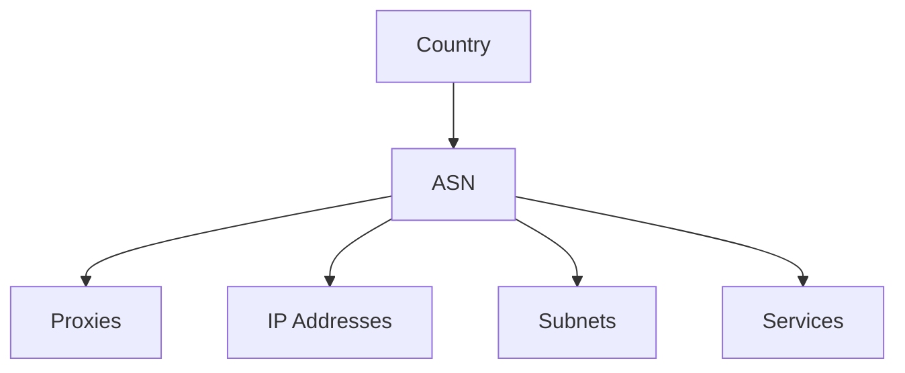

The ASN (Autonomous System Number) object represents a network or group of networks operated by a single organization in the Ping Proxies system. ASNs are globally unique identifiers assigned to organizations that control blocks of IP addresses, such as internet service providers, hosting companies, and large enterprises.

## Key Attributes

| Attribute | Type | Description |
|-----------|------|-------------|
| `asn_id` | integer | The unique identifier for the ASN (e.g., 7018 for AT&T) |
| `asn_name` | string | The name of the organization that owns the ASN |
| `asn_type` | string | Category of the ASN (e.g., isp, hosting, business, cdn, education, gov) |
| `asn_rir` | string | Regional Internet Registry that assigned the ASN (arin, ripe, apnic, lacnic, afrinic) |
| `asn_ip_address_count` | integer | The number of IP addresses allocated to this ASN |
| `country_id` | string | The primary country where the ASN is registered |

## Object Relationships

The ASN object connects with several other objects in the Ping Proxies API:

- **Proxies**: ASNs are assigned to specific proxies, determining their network identity
- **IP Addresses**: Each IP address belongs to an ASN
- **Subnets**: Groups of IP addresses within an ASN
- **Services**: Proxy services may be filtered or targeted by ASN
- **Countries**: ASNs are typically associated with specific countries

## Related Endpoints

| Endpoint | Description |
|----------|-------------|
| `GET /public/user/asn/retrieve/{asn_id}` | Retrieve a specific ASN by ID |
| `GET /public/user/asn/search` | Search ASNs using various filters |
| `GET /public/user/proxy/search?asn_id={asn_id}` | Find proxies associated with a specific ASN |

## Usage Notes

- ASNs provide important context about the quality, type, and reputation of proxies
- For residential proxies, you can target specific ASNs in the `/residential/list` endpoint
- The `asn_ip_address_count` gives an indication of the size and potential diversity of IPs within an ASN

## ASN Type Categories

ASNs are categorized into several types, each with distinct characteristics:

| ASN Type | Description | Examples |
|----------|-------------|----------|
| `isp` | Consumer internet service providers | AT&T (7018), Comcast (7922) |
| `hosting` | Cloud and hosting providers | AWS (16509), Cloudflare (13335) |
| `business` | Enterprise/corporate networks | Apple (714), Microsoft (8075) |
| `cdn` | Content delivery networks | Akamai (20940), Fastly (54113) |
| `education` | Universities and research institutions | MIT (3), Stanford (32) |
| `gov` | Government institutions | US Department of Defense (721) |

When selecting proxies for specific use cases, the ASN type often matters more than the specific ASN itself, as it indicates the general traffic pattern and reputation of the network.