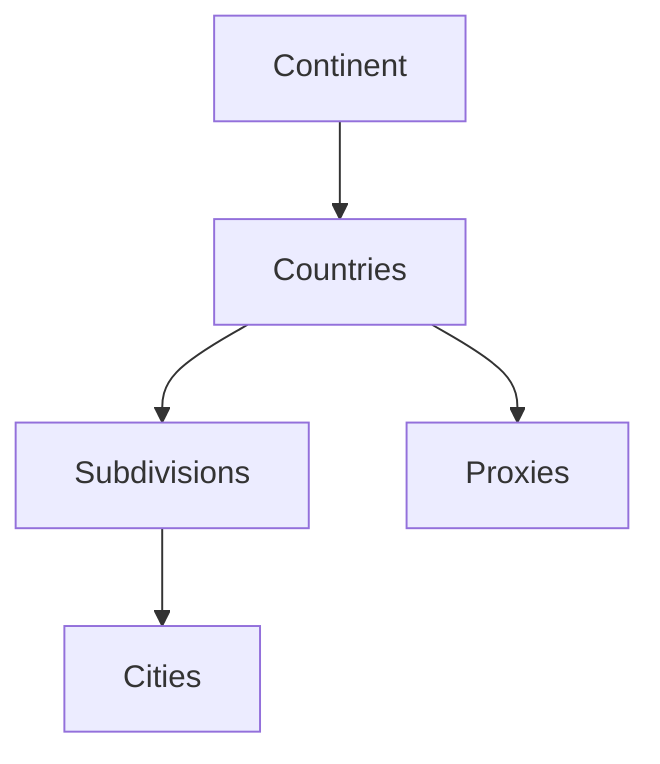

The Continent object represents a geographical continent in the Ping Proxies system. It serves as the highest level in the geographic hierarchy and contains essential information about continents including their identifiers, names, and aliases.

## Key Attributes

| Attribute | Type | Description |
|-----------|------|-------------|
| `continent_id` | string | Unique identifier for the continent (e.g., `eu` for Europe) |
| `continent_name` | string | Full name of the continent (e.g., `Europe`) |
| `continent_alias` | string | Alternative identifier or shorthand for the continent |

## Object Relationships

The Continent object sits at the top of the geographic hierarchy in the Ping Proxies API:

- **Countries**: Each continent contains multiple countries
- **Subdivisions**: Indirectly related through countries
- **Cities**: Indirectly related through countries and subdivisions
- **Proxies**: Proxies can be filtered or grouped by continent through their country associations



## Related Endpoints

| Endpoint | Description |
|----------|-------------|
| `GET /public/user/continent/retrieve/{continent_id}` | Retrieve a specific continent by ID |
| `GET /public/user/continent/search` | Search continents using various filters |
| `GET /public/user/country/search?continent_id={continent_id}` | Find countries within a specific continent |

## Example Response

```json
{
  "data": {
    "continent_id": "eu",
    "continent_name": "Europe",
    "continent_alias": "eu"
  },
  "message": "Continent successfully retrieved."
}
```

## Usage Notes

- Continents provide the broadest geographic categorization in the system
- The `continent_id` typically uses a two-letter code (e.g., `eu`, `na`, `as`)
- When filtering proxy locations, using continent-level filtering provides the broadest geographic targeting
- The continent object is primarily used for reference and categorization rather than direct operations
- For more precise geographic targeting, use the country, subdivision, or city objects instead

## Continent Codes

The system uses the following standard continent codes:

| Code | Continent |
|------|-----------|
| `af` | Africa |
| `an` | Antarctica |
| `as` | Asia |
| `eu` | Europe |
| `na` | North America |
| `oc` | Oceania |
| `sa` | South America |

These continent codes are consistent throughout the API and provide a standardized way to reference continents when performing geographic filtering or categorization.