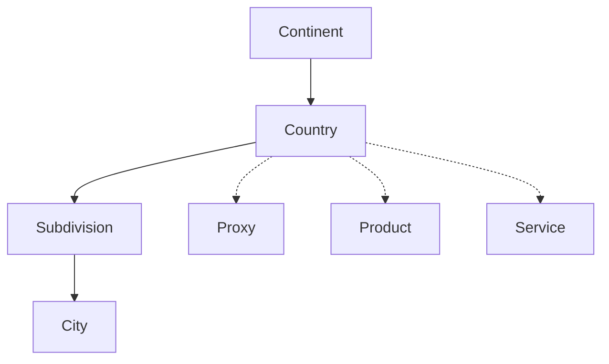

The Country object represents a geographic country entity in the Ping Proxies system. It contains essential information about countries including their identifiers, names, geographic location, and special designations such as EU membership status.

## Key Attributes

| Attribute | Type | Description |
|-----------|------|-------------|
| `country_id` | string | Unique two-letter identifier for the country (ISO 3166-1 alpha-2 code) |
| `country_name` | string | Full name of the country |
| `country_alias` | string | Alternative or shortened identifier for the country |
| `continent_id` | string | Identifier of the continent where the country is located |
| `country_is_european_union` | boolean | Indicates if the country is a member of the European Union |

## Object Relationships

The Country object is connected to several other objects in the Ping Proxies API:

- **Continent**: Each country belongs to a specific continent
- **Subdivisions**: Countries contain multiple subdivisions (states, provinces, regions)
- **Cities**: Countries contain multiple cities directly or through subdivisions
- **Proxies**: Proxies are physically located within countries
- **Products**: Products may be region-specific and tied to particular countries
- **Services**: Services may be region-specific and tied to particular countries



## Related Endpoints

| Endpoint | Description |
|----------|-------------|
| `GET /public/user/country/retrieve/{country_id}` | Retrieve a specific country |
| `GET /public/user/country/search` | Search countries with various filters |
| `GET /public/user/subdivision/search?country_id={country_id}` | Get subdivisions in a specific country |

## Example Response

```json
{
  "data": {
    "continent_id": "eu",
    "country_alias": "fr",
    "country_id": "fr",
    "country_is_european_union": true,
    "country_name": "France"
  },
  "message": "Country successfully retrieved."
}
```

## Usage Notes

- The `country_id` uses the ISO 3166-1 alpha-2 standard (e.g., "us" for United States, "gb" for United Kingdom)
- Country objects are most commonly used as filters when:
  - Searching for proxies in specific geographic regions
  - Generating residential proxy lists with geographic targeting
  - Purchasing region-specific proxy services
  - Analyzing usage patterns across different geographic regions
- The `country_is_european_union` flag is particularly useful for compliance with GDPR and other EU-specific regulations
- For more granular geographic targeting, combine country filters with subdivision and city filters
- When working with products and services, `country_id` is commonly used to identify region-specific offerings

## Geographic Hierarchy

Countries are part of a larger geographic hierarchy in the Ping Proxies system:
1. **Continent**: The broadest geographic division
2. **Country**: Countries within continents
3. **Subdivision**: States, provinces, or regions within countries
4. **City**: Specific cities within subdivisions

This hierarchical structure allows for increasingly precise geographic targeting of proxies.