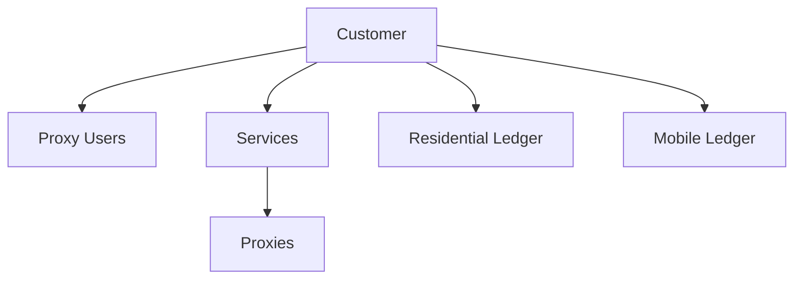

The Customer object represents an account holder in the Ping Proxies system. It contains essential information about a user including their contact details, billing information, and account settings.

## Key Attributes

| Attribute | Type | Description |
|-----------|------|-------------|
| `customer_id` | integer | Unique identifier for the customer |
| `customer_email_address` | string | Primary email address for the account |
| `customer_first_name` | string | Customer's first name |
| `customer_last_name` | string | Customer's last name |
| `credit_balance` | integer | Available credit balance in cents |
| `customer_proxy_user_limit` | integer | Maximum number of proxy users allowed |
| `proxy_count` | integer | Total number of proxies associated with the account |
| `residential_bytes_left` | integer | Remaining residential bandwidth in bytes |
| `active_residential_service_id` | string | ID of the active residential service |
| `mobile_bytes_left` | integer | Remaining mobile bandwidth in bytes |
| `active_mobile_service_id` | string | ID of the active mobile service |

## Object Relationships

The Customer object is a parent to several other objects in the Ping Proxies API:

- **Proxy Users**: Authentication entities created by the customer
- **Services**: Subscriptions to proxy products
- **Proxies**: Individual proxies allocated to the customer's services
- **Residential Ledger**: Records of residential bandwidth usage
- **Mobile Ledger**: Records of mobile bandwidth usage



## Related Endpoints

| Endpoint | Description |
|----------|-------------|
| `GET /public/user/customer/retrieve` | Retrieve the authenticated customer's profile |

## Example Response

```json
{
  "data": {
    "customer_id": 1955,
    "customer_email_address": "steve.jobs@apple.com",
    "customer_first_name": "Steve",
    "customer_last_name": "Jobs",
    "credit_balance": 1245,
    "customer_proxy_user_limit": 5,
    "proxy_count": 100,
    "residential_bytes_left": 10737418240,
    "active_residential_service_id": "1955-8012-871",
    "mobile_bytes_left": 10737418240,
    "active_mobile_service_id": "1935-1517-112"
  },
  "message": "Customer successfully retrieved."
}
```

## Usage Notes

- The `credit_balance` is displayed in cents (e.g., 1245 means $12.45)
- When purchasing via API, services must be paid with account credit
- The `residential_bytes_left` shows remaining bandwidth for residential proxies
- The `mobile_bytes_left` shows remaining bandwidth for mobile proxies
- The `customer_proxy_user_limit` determines how many proxy users you can create

## Best Practices

- Regularly check your `credit_balance` before making API purchases
- Monitor your `residential_bytes_left` and `mobile_bytes_left` to avoid service interruptions
- Use the `customer_id` to reference your account in support requests
