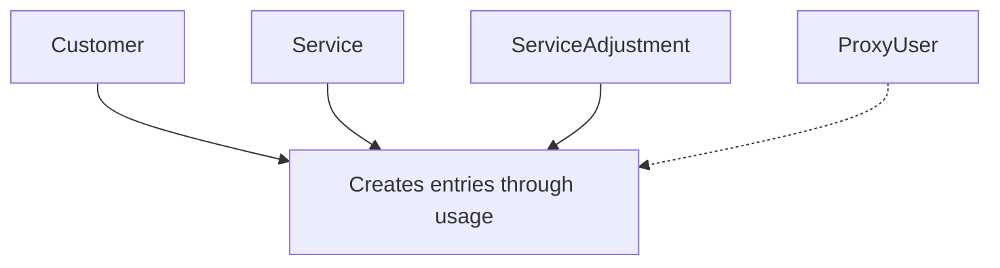

The Mobile Ledger object represents a record of mobile bandwidth usage or allocation in the Ping Proxies system. It serves as a complete audit trail that tracks all changes to the mobile bandwidth pool associated with a customer account, including daily usage consumption, top-ups, service purchases, and administrative adjustments.

## Key Attributes

| Attribute | Type | Description |
|-----------|------|-------------|
| `mobile_ledger_id` | string | Unique identifier for the ledger entry |
| `mobile_ledger_bytes` | integer | Amount of bandwidth in bytes associated with this ledger entry |
| `mobile_ledger_requests` | integer | Number of requests associated with this ledger entry |
| `mobile_ledger_period_date` | string | The date this ledger entry is associated with |
| `mobile_ledger_reason` | string | Reason for the ledger entry (e.g., "usage", "top_up", "service_purchase") |
| `service_id` | string | ID of the related service if applicable |
| `service_adjustment_id` | integer | ID of the related service adjustment if applicable |
| `mobile_ledger_creation_datetime` | datetime | When the ledger entry was created |
| `mobile_ledger_last_update_datetime` | datetime | When the ledger entry was last updated |

## Object Relationships

The Mobile Ledger object is connected to several other objects in the Ping Proxies API:

- **Customer**: Each mobile ledger entry belongs to a customer account
- **Service**: Entries may be associated with a mobile service (e.g., when purchasing additional bandwidth)
- **Service Adjustment**: Entries may be linked to service adjustments (e.g., refunds or manual adjustments)
- **Proxy User**: While not directly linked, proxy users consume bandwidth which creates ledger entries



## Related Endpoints

| Endpoint | Description |
|----------|-------------|
| `GET /public/user/mobile_ledger/retrieve/{mobile_ledger_id}` | Retrieve a specific mobile ledger entry |
| `GET /public/user/mobile_ledger/search` | Search mobile ledger entries with filters |
| `GET /public/user/mobile/summary` | Get a summary of mobile bandwidth status |

## Example Response

```json
{
  "data": {
    "customer_id": 1955,
    "mobile_ledger_bytes": 128290101,
    "mobile_ledger_creation_datetime": "2023-04-01 12:00:00",
    "mobile_ledger_id": "123e4567-e89b-12d3-a456-426614174000",
    "mobile_ledger_last_update_datetime": "2023-04-02 12:00:00",
    "mobile_ledger_period_date": "2023-10-01",
    "mobile_ledger_reason": "top_up",
    "mobile_ledger_requests": 1244,
    "service_adjustment_id": 10,
    "service_id": "API-1234-5678"
  },
  "message": "Mobile Ledger successfully retrieved."
}
```

## Ledger Entry Types

Mobile ledger entries have various reason types that indicate different bandwidth changes:

| Reason | Description |
|--------|-------------|
| `usage` | Daily decrements to the bandwidth pool from proxy usage |
| `top_up` | Increments from purchasing additional bandwidth |
| `adjustment` | Manual adjustments (positive or negative) made by administrators |

## Usage Notes

- The mobile ledger is maintained at the account bandwidth pool level, not per proxy
- Usage entries are aggregated daily, providing a day-by-day audit trail of bandwidth consumption
- Entries with positive `mobile_ledger_bytes` values add to your bandwidth pool (top-ups, purchases)
- Entries with negative `mobile_ledger_bytes` values subtract from your bandwidth pool (usage)
- The `mobile_ledger_period_date` field indicates the specific day when usage occurred or changes were made
- Unlike datacenter and ISP proxies, mobile proxies operate on a bandwidth-based billing model
- There is no automatic expiration for mobile bandwidth - it remains in your account until consumed
- For real-time bandwidth status, use the `/mobile/summary` endpoint
