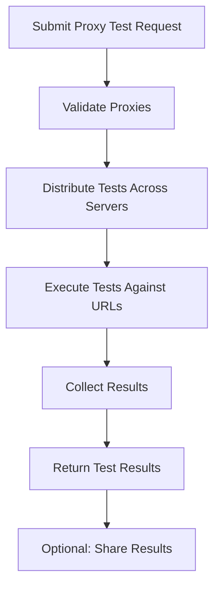

## Key Components

### Proxy Test Run

The core testing workflow that orchestrates proxy validation across multiple test servers and target URLs.

| Attribute | Type | Description |
|-----------|------|-------------|
| `proxy_test_run_id` | string (uuid) (optional) | Unique identifier for the test run |
| `proxies` | array | List of proxies to test with their configurations |
| `urls` | array | Target URLs to test against |
| `proxy_tester_server_id` | array (optional) | Test servers to use for validation |

If not test server is provided, all test servers will be used.

### Proxy Test Result

Individual test results for each proxy-URL-server combination.

| Attribute | Type | Description |
|-----------|------|-------------|
| `proxy_test_result_id` | string (uuid) | Unique identifier for this specific test result |
| `proxy_test_result_url` | string | The URL that was tested |
| `proxy_test_result_status_code` | integer | HTTP status code returned |
| `proxy_test_result_protocol` | string | Protocol used (http/https) |
| `proxy_test_result_response_time` | integer | Response time in milliseconds |
| `proxy_test_server_id` | string | ID of the test server used |
| `proxy_test_server_city_name` | string | City where the test server is located |
| `proxy_test_server_country_id` | string | Country code of the test server |
| `proxy_username` | string | Username used for proxy authentication |
| `proxy_host` | string | Proxy server hostname/IP |
| `proxy_port` | integer | Proxy server port |
| `proxy_country_id` | string | Country where the proxy is located |
| `proxy_city_name` | string | City where the proxy is located |
| `proxy_asn_name` | string | ASN information for the proxy |

### Proxy Test Server

Geographic test servers that perform the actual proxy validation.

| Attribute | Type | Description |
|-----------|------|-------------|
| `proxy_test_server_id` | string | Unique identifier for the test server |
| `city_name` | string | City where the test server is located |
| `country_id` | string | Country code of the test server |
| `proxy_test_server_active` | boolean | Whether the server is currently active |
| `proxy_test_server_ip_address` | string | IP address of the test server |
| `proxy_test_server_port` | integer | Port used by the test server |

## Testing Workflow



## Related Endpoints

| Endpoint | Description |
|----------|-------------|
| `POST /public/proxy_tester/proxy_test_run/create` | Create a new proxy test run |
| `GET /public/proxy_tester/proxy_test_run/retrieve/{test_run_id}` | Retrieve test results |
| `POST /public/proxy_tester/proxy_test_run/share/{test_run_id}` | Share test results with password protection |
| `GET /public/proxy_tester/proxy_test_server/search` | Get available test servers |

## Example Test Request

```json
{
  "proxies": [
    {
      "proxy_string": "209.99.134.6:5702:ftrdddgq:518vrc41xyms"
    }
  ],
  "proxy_tester_server_id": [
    "london-2-digitalocean-proxytester-1",
    "newyork-3-digitalocean-proxytester-1"
  ],
  "urls": [
    "https://google.com",
    "https://httpbin.org/ip"
  ],
  "proxy_test_run_id": "8ca1bf7f-7e8e-490e-ad0a-715e5eb060a6"
}
```

## Example Test Results

```json
{
  "data": {
    "201a677b-214f-43f6-b457-76d8d196f815": {
      "results": [
        {
          "proxy_test_result_id": "38c1c64b-af29-4e3d-93f2-4c1a1a313ac5",
          "proxy_test_result_url": "https://google.com",
          "proxy_test_result_status_code": 200,
          "proxy_test_result_response_time": 224,
          "proxy_test_server_city_name": "London",
          "proxy_test_server_country_id": "gb",
          "proxy_host": "148.135.178.94",
          "proxy_port": 5655,
          "proxy_country_id": "fr",
          "proxy_city_name": "New York City",
          "proxy_asn_name": "AS29802 HIVELOCITY, Inc."
        }
      ]
    }
  },
  "message": "Successfully returned proxy test data",
  "created": ["a23539ac-714d-4d88-9b05-a4f81432a9b9"]
}
```

## Usage Notes

- **Multi-Location Testing**: Tests are executed from multiple geographic locations to verify proxy performance globally
- **Performance Metrics**: Response times are measured to help identify the fastest proxies for your use case
- **Geographic Accuracy**: Test results include both proxy exit location and test server location for geographic validation
- **Batch Processing**: Multiple proxies can be tested simultaneously for efficiency
- **Result Sharing**: Test results can be shared securely with password protection
- **Server Selection**: Choose specific test servers or let the system automatically select the closest ones
- **Authentication Testing**: Proxy authentication is validated as part of the testing process

## Best Practices

- **Test Server Selection**: Use test servers in regions where you plan to use the proxies
- **URL Variety**: Test against different types of websites (search engines, APIs, content sites) to ensure broad compatibility
- **Regular Testing**: Implement regular proxy testing to maintain service quality
- **Performance Monitoring**: Monitor response times to identify degraded proxies before they impact your operations
- **Geographic Validation**: Verify that proxy exit locations match your targeting requirements
