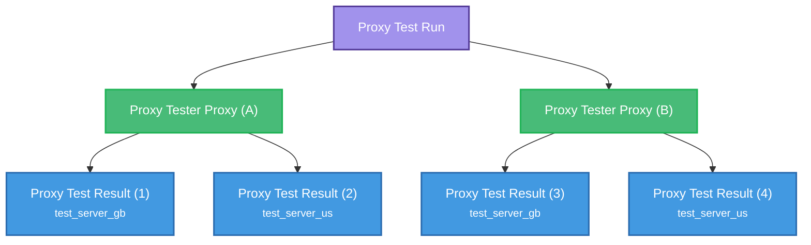

## Object Relationships

The Continent object sits at the top of the geographic hierarchy in the Ping Proxies API:

- **Proxy Test Run**: The whole test that has run
- **Proxy Tester Proxy**: Each proxy that has been tested
- **Proxy Test Result**: The result of the test for a given proxy
- **Proxy Test Server**: The server being used for each proxy test

In the scenario below, **proxy A** and **proxy B** are being tested against `test_server_gb` and `test_server_us`.

The following objects are created:

## Key Components

### Proxy Test Run

The core testing workflow that orchestrates proxy validation across multiple test servers and target URLs.

| Attribute | Type | Description |
|-----------|------|-------------|
| `proxy_test_run_id` | string (uuid) (optional) | Unique identifier for the test run |
| `proxies` | array | List of proxy objects to test with their configurations (Maximum 20)|
| `urls` | array | Target URLs to test against |
| `proxy_tester_server_id` | array (optional) | Test servers to use for validation |

If no test server is provided, all test servers will be used.

No more than 20 proxies can be tested in the same request.

### Proxy Test Result

Individual test results for each proxy-URL-server combination.

| Attribute | Type | Description |
|-----------|------|-------------|
| `proxy_test_result_id` | string (uuid) | Unique identifier for this specific test result |
| `proxy_test_result_url` | string | The URL that was tested |
| `proxy_test_result_status_code` | integer | HTTP status code returned |
| `proxy_test_result_protocol` | string | Protocol used |
| `proxy_test_result_response_time` | integer | Response time in milliseconds |
| `proxy_test_server_id` | string | ID of the test server used |
| `proxy_test_server_city_name` | string | City where the test server is located |
| `proxy_test_server_country_id` | string | Country code of the test server |
| `proxy_username` | string | Username used for proxy authentication |
| `proxy_host` | string | Proxy server hostname/IP |
| `proxy_port` | integer | Proxy server port |
| `proxy_country_id` | string | Country where the proxy is located |
| `proxy_city_name` | string | City where the proxy is located |
| `proxy_asn_name` | string | ASN information for the proxy |

### Proxy Test Server

Geographic test servers that perform the actual proxy validation.

| Attribute | Type | Description |
|-----------|------|-------------|
| `proxy_test_server_id` | string | Unique identifier for the test server |
| `city_name` | string | City where the test server is located |
| `country_id` | string | Country code of the test server |
| `proxy_test_server_active` | boolean | Whether the server is currently active |
| `proxy_test_server_ip_address` | string | IP address of the test server |
| `proxy_test_server_port` | integer | Port used by the test server |

## Related Endpoints

| Endpoint | Description |
|----------|-------------|
| `POST /public/proxy_test_run/create` | Create a new proxy test run |
| `GET /public/proxy_test_run/retrieve/{test_run_id}` | Retrieve test results |
| `POST /public/proxy_test_run/share/{test_run_id}` | Share test results with password protection |
| `GET /public/proxy_test_server/search` | Get available test servers |

