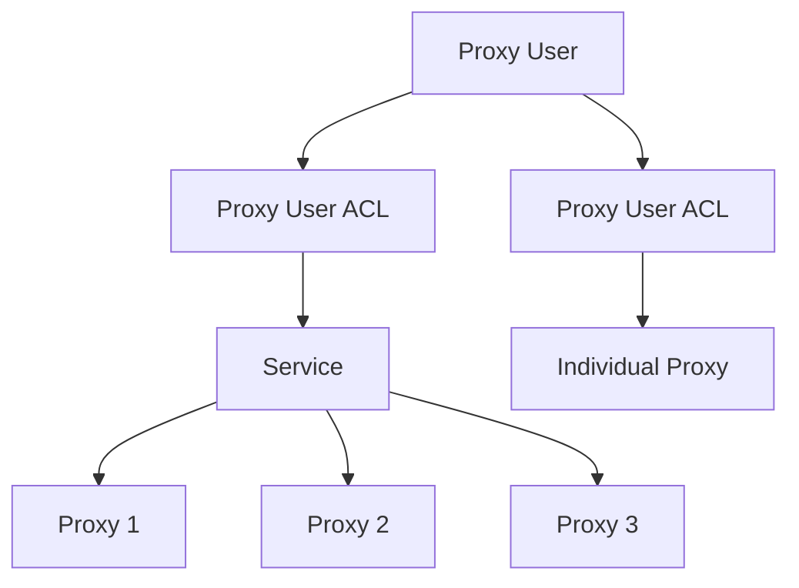

The Proxy User ACL (Access Control List) object defines granular access permissions for proxy users. It allows you to control whether a proxy user can access specific services or individual proxies, enabling flexible access management for different use cases such as team segregation, reselling, or fine-grained security controls.

<Info>
Default Proxy Users cannot have ACL rules applied and have access to all proxies on your account.
</Info>

## Key Attributes

| Attribute | Type | Description |
|-----------|------|-------------|
| `proxy_user_acl_id` | string | Unique identifier for the ACL entry (UUID format) |
| `proxy_user_id` | string | ID of the proxy user this ACL entry applies to |
| `service_id` | string | Service ID to grant access to (mutually exclusive with `proxy_id`) |
| `proxy_id` | string | Proxy ID to grant access to (mutually exclusive with `service_id`) |
| `proxy_user_acl_creation_datetime` | datetime | Timestamp when the ACL entry was created |

## Access Control Model

Proxy User ACL entries work in conjunction with the `proxy_user_access_type` field on the Proxy User object:

- **`access_type: "all"`**: No ACL entries needed. Proxy user has unrestricted access to all proxies.
- **`access_type: "service_restricted"`**: ACL entries with `service_id` define which services the proxy user can access. The user can use any proxy within those services.
- **`access_type: "proxy_restricted"`**: ACL entries with `proxy_id` define which specific individual proxies the proxy user can access.

<Note>
Each ACL entry must contain **either** a `service_id` **or** a `proxy_id`, but never both. The type of ID must match the proxy user's `access_type`.
</Note>

## Use Cases

### Service-Restricted Access
Perfect for organizing proxy access by teams, departments, or customers:

```json
{
  "proxy_user_id": "seo_team",
  "service_id": "API-SEO-POOL-001"
}
```

The `seo_team` proxy user can access all proxies in the `API-SEO-POOL-001` service.

### Proxy-Restricted Access
Ideal for reselling individual proxies or highly granular access control:

```json
{
  "proxy_user_id": "customer_123",
  "proxy_id": "550e8400-e29b-41d4-a716-446655440001"
}
```

The `customer_123` proxy user can only access this specific proxy.

## Object Relationships

The Proxy User ACL creates a many-to-many relationship between proxy users and their accessible resources:



- **Proxy User**: A single proxy user can have multiple ACL entries
- **Service**: When an ACL grants service access, the user can access all proxies in that service
- **Proxy**: When an ACL grants proxy access, the user can only access that specific proxy
- **Multiple ACLs**: You can create multiple ACL entries to grant access to multiple services or proxies

## Related Endpoints

| Endpoint | Method | Description |
|----------|--------|-------------|
| `/public/user/proxy_user_acl/create` | POST | Create a new ACL entry |
| `/public/user/proxy_user_acl/retrieve/{proxy_user_acl_id}` | GET | Retrieve a specific ACL entry |
| `/public/user/proxy_user_acl/search` | GET | Search ACL entries with filters |
| `/public/user/proxy_user_acl/delete/{proxy_user_acl_id}` | DELETE | Delete an ACL entry |

## Example Response

```json
{
  "data": {
    "proxy_user_acl_id": "550e8400-e29b-41d4-a716-446655440000",
    "proxy_user_id": "stevejobs",
    "service_id": "API-1234-5678",
    "proxy_user_acl_creation_datetime": "2023-09-28 12:34:56"
  },
  "message": "Proxy User Acl successfully retrieved."
}
```

## Usage Notes

- ACL entries can only be created for proxy users with `access_type` set to `"service_restricted"` or `"proxy_restricted"`
- The service or proxy specified in the ACL must belong to the same customer account as the proxy user
- When changing a proxy user's `access_type` to `"all"`, you must clear all existing ACL entries using the `clear_proxy_user_acl` parameter
- Deleting a proxy user automatically deletes all associated ACL entries
- You can have multiple ACL entries for the same proxy user to grant access to multiple services or proxies
