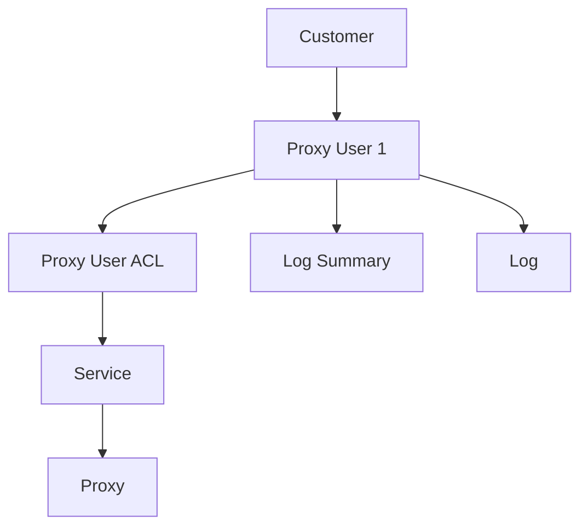

The Proxy User object represents an authentication entity used to access proxies. It functions as a layer between your customer account and your proxies, enabling flexible access control, usage tracking, and bandwidth management.

## Key Attributes

| Attribute | Type | Description |
|-----------|------|-------------|
| `proxy_user_id` | string | Unique identifier for the proxy user (acts as username) |
| `proxy_user_password` | string | Password for proxy authentication |
| `proxy_user_access_type` | string | Access control type: `"all"` (unrestricted), `"service_restricted"`, or `"proxy_restricted"` |
| `proxy_user_is_strict_security` | boolean | Whether IP authentication is required |
| `proxy_user_residential_bytes_limit` | integer | Maximum residential bandwidth allocation in bytes |
| `proxy_user_residential_bytes_used` | integer | Used residential bandwidth in bytes |
| `proxy_user_mobile_bytes_limit` | integer | Maximum mobile bandwidth allocation in bytes |
| `proxy_user_mobile_bytes_used` | integer | Used mobile bandwidth in bytes |
| `proxy_user_metadata` | object | Custom metadata for tracking and organization |
| `ip_address_authentications` | array | List of IP addresses authorized to use this proxy user |

## Authentication Methods

Proxy Users support three authentication methods:

1. **Username/Password Authentication**: Standard method using `proxy_user_id` and `proxy_user_password`
2. **IP Authentication**: Access based on client IP address matching entries in `ip_address_authentications`
3. **Combined Authentication**: Requiring both username/password and IP authentication when `proxy_user_is_strict_security` is enabled

## Access Control

Proxy Users support three access control types via the `proxy_user_access_type` field:

- **`"all"`** (default): Unrestricted access to all proxies in your account
- **`"service_restricted"`**: Access limited to specific services via Proxy User ACL entries
- **`"proxy_restricted"`**: Access limited to specific individual proxies via Proxy User ACL entries

When using `"service_restricted"` or `"proxy_restricted"` access types, you must create Proxy User ACL entries to grant access to specific services or proxies. See the [Proxy User ACL object documentation](/api-objects/proxy-user-acl) for details.

## Object Relationships

The Proxy User acts as an intermediary between your customer account and your proxy services:



- **Customer**: A single customer can have multiple proxy users
- **Proxy User ACL**: Controls which services or proxies a proxy user can access (when access_type is restricted)
- **Services**: A proxy user can access multiple services based on their ACL entries
- **Proxies**: Proxies are accessed through proxy users, which control authentication and authorization
- **Logs**: Usage logs are associated with specific proxy users for tracking
- **Log Summaries**: Aggregated usage data is linked to proxy users

## Related Endpoints

| Endpoint | Method | Description |
|----------|--------|-------------|
| `/public/user/proxy_user/create` | POST | Create a new proxy user |
| `/public/user/proxy_user/retrieve/{proxy_user_id}` | GET | Retrieve a specific proxy user |
| `/public/user/proxy_user/search` | GET | Search proxy users with filters |
| `/public/user/proxy_user/edit/{proxy_user_id}` | PATCH | Edit an existing proxy user |
| `/public/user/proxy_user/delete/{proxy_user_id}` | DELETE | Delete a proxy user |

## Example Response

```json
{
  "data": {
    "proxy_user_id": "stevejobs",
    "proxy_user_password": "apple1984",
    "proxy_user_access_type": "all",
    "proxy_user_ip_address_authentication_limit": 3,
    "proxy_user_is_default": false,
    "proxy_user_is_deleted": false,
    "proxy_user_is_strict_security": false,
    "proxy_user_metadata": {
      "resell_order_id": "APPL-9876-5432"
    },
    "proxy_user_residential_bytes_limit": 134142432,
    "proxy_user_residential_bytes_used": 31223,
    "residential_bytes_left": 134111209,
    "proxy_user_mobile_bytes_limit": 134142432,
    "proxy_user_mobile_bytes_used": 31223,
    "mobile_bytes_left": 134111209,
    "ip_address_authentications": [
      "193.222.13.1"
    ],
    "restricted_service_ids": [],
    "restricted_proxy_ids": []
  },
  "message": "Proxy User successfully retrieved."
}
```

## Usage Notes

- Each customer account can have multiple proxy users (limited by `customer_proxy_user_limit`)
- The default proxy user is automatically created with each account
- Proxy users can be used for traditional proxies, mobile and residential services
- Use proxy users to organize access to different proxy groups or for different teams
- Metadata allows for custom organization (e.g., by department, project, or client)
- For access control, use the `proxy_user_access_type` field in combination with [Proxy User ACL](/api-objects/proxy-user-acl) entries
