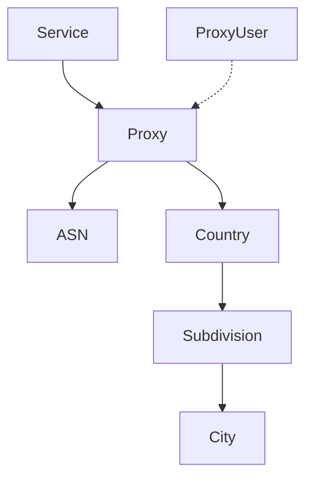

The Proxy object represents an individual proxy instance in the Ping Proxies system. It contains essential information about a proxy including its network details, authentication settings, geographic location, and operational status.

## Key Attributes

| Attribute | Type | Description |
|-----------|------|-------------|
| `proxy_id` | string | Unique identifier for the proxy (UUID format) |
| `proxy_ip_address` | string | Main IPv4 address of the proxy |
| `proxy_protocol` | string | IP protocol of the proxy (ipv4, ipv6, dual) |
| `proxy_type` | string | Type of proxy (datacenter, isp, residential) |
| `proxy_http_port` | integer | HTTP port number for the proxy |
| `proxy_socks5_port` | integer | SOCKS5 port number for the proxy |
| `proxy_status` | string | Current status of the proxy (available, in_use, reserved, etc.) |
| `proxy_username` | string | Proxy-specific authentication username (if configured) |
| `proxy_password` | string | Proxy-specific authentication password (if configured) |
| `service_id` | string | ID of the service this proxy is associated with |
| `country_id` | string | ISO country code where the proxy is located |
| `asn_id` | integer | Autonomous System Number (network provider) |
| `city_id` | integer | ID of the city where the proxy is located |
| `subdivision_id` | string | ID of the region/state where the proxy is located |

## Network Attributes

The Proxy object includes detailed network information:

| Attribute | Type | Description |
|-----------|------|-------------|
| `ip_address_id_v4` | string | IPv4 address identifier |
| `ip_address_id_v6` | string | IPv6 address identifier (for dual or ipv6 proxies) |
| `subnet_id` | string | IPv4 subnet the proxy belongs to |
| `subnet_id_v6` | string | IPv6 subnet the proxy belongs to (for dual or ipv6 proxies) |
| `asn_name` | string | Name of the Autonomous System (e.g., "AT&T Services, Inc.") |

## Geographic Attributes

Proxies include detailed geographic information:

| Attribute | Type | Description |
|-----------|------|-------------|
| `country_name` | string | Full name of the country (e.g., "United States") |
| `subdivision_name` | string | Full name of the region/state (e.g., "California") |
| `city_name` | string | Full name of the city (e.g., "Los Angeles") |
| `city_latitude` | number | Latitude coordinates of the city |
| `city_longitude` | number | Longitude coordinates of the city |
| `city_timezone` | string | Timezone of the city (e.g., "America/Los_Angeles") |

## Object Relationships

The Proxy object connects to several other objects in the Ping Proxies API:

- **Service**: Each proxy belongs to a service subscription
- **Customer**: Proxies are ultimately owned by a customer through services
- **Proxy User**: Proxy users can access proxies for authentication
- **ASN**: Provides network operator details for the proxy
- **Geographic Entities**: Country, subdivision, and city information

## Proxy Status Values

| Status | Description |
|--------|-------------|
| `available` | Proxy is ready but not actively assigned |
| `in_use` | Proxy is actively assigned to a service and available for use |
| `reserved` | Proxy is reserved for future use |
| `waiting` | Proxy is being provisioned or prepared |
| `pending_deletion` | Proxy is scheduled for removal |

## Related Endpoints

| Endpoint | Description |
|----------|-------------|
| `GET /public/user/proxy/retrieve/{proxy_id}` | Retrieve a specific proxy |
| `GET /public/user/proxy/search` | Search proxies with filters |
| `GET /public/user/proxy/list_by_search` | Retrieve formatted proxy lists |
| `POST /public/user/proxy/list_by_id` | Generate formatted proxy lists by ID |
| `PATCH /public/user/proxy/edit/{proxy_id}` | Edit a proxy |

## Usage Notes

- Proxies can be accessed using the default proxy user or proxy-specific authentication
- For IPv4 proxies, use `proxy_ip_address` or `ip_address_id_v4` (they contain the same value if you've purchased IPv4 proxies)
- For IPv6 or dual-stack proxies, the IPv6 address is stored in `ip_address_id_v6`
- The combination of IP address and port is unique to each proxy
- When listing proxies, the proxy object will include additional formatted fields:
  - `http_formatted`: Formatted HTTP proxy string
  - `socks5_formatted`: Formatted SOCKS5 proxy string

## Authentication Methods

Proxies can be accessed using three authentication methods:

1. **Proxy User Authentication**: Using a proxy user's credentials
2. **IP Authentication**: Allowing specific client IP addresses
3. **Proxy-Specific Authentication**: Using credentials specific to a single proxy

## Proxy Types and Differences

Each proxy type has unique characteristics:

- **Datacenter Proxies**: Static proxies hosted in data centers
- **ISP Proxies**: Static proxies with residential-type IP addresses from major ISPs
- **Residential Proxies**: Dynamic proxies from real residential connections

While datacenter and ISP proxies are represented as persistent proxy objects, residential proxies are generated dynamically and don't have persistent proxy objects.