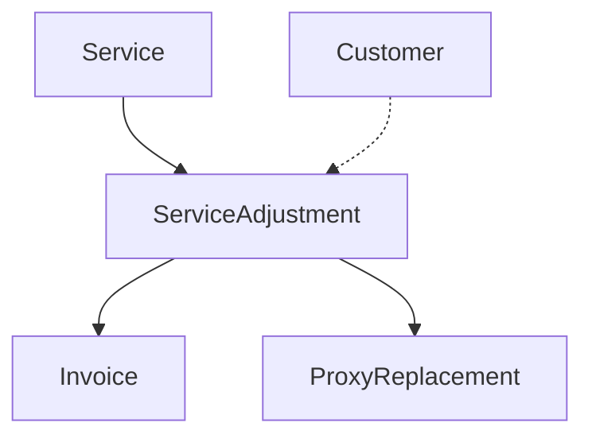

The Service Adjustment object represents a record of changes made to services in the Ping Proxies system. It provides a detailed audit trail of any modifications to a service, including who made the change, when it was made, and what was modified.

## Key Attributes

| Attribute | Type | Description |
|-----------|------|-------------|
| `service_adjustment_id` | integer | Unique identifier for the service adjustment |
| `service_id` | string | ID of the service that was modified |
| `service_adjustment_type` | string | Type of adjustment (e.g., `extension`, `fulfillment`, `proxy_replacement`) |
| `service_adjustment_status` | string | Status of the adjustment (`pending`, `complete`, `failed`) |
| `service_adjustment_pre` | object | JSON representation of the service state before the adjustment |
| `service_adjustment_post` | object | JSON representation of the service state after the adjustment |
| `service_adjustment_eval` | object | Evaluation of changes between pre and post states |
| `service_adjustment_is_administrator` | boolean | Whether the adjustment was made by a Ping Proxies administrator |
| `service_adjustment_is_automatic` | boolean | Whether the adjustment was made automatically by the system |
| `service_adjustment_is_customer` | boolean | Whether the adjustment was made by the customer |
| `service_adjustment_creation_datetime` | datetime | When the adjustment was created |
| `service_adjustment_last_update_datetime` | datetime | When the adjustment was last updated |
| `invoice_id` | string | ID of any invoice associated with the adjustment |

## Service Adjustment Types

Service adjustments can be of various types, each representing a different kind of change:

| Type | Description |
|------|-------------|
| `ingestion` | Initial creation and ingestion of a service |
| `fulfillment` | Allocation of proxies to a service |
| `remove_proxy` | Removal of proxies from a service |
| `additional_fulfillment` | Adding more proxies to an existing service |
| `update` | General update to service attributes |
| `proxy_replacement` | Replacing proxies with new ones |
| `extension` | Extending the service period |
| `top_up` | Adding additional bandwidth to a residential or mobile service |
| `top_up_and_extension` | Both extending service and adding bandwidth |
| `cancel` | Cancellation of a service |

## Object Relationships

The Service Adjustment object is connected to several other objects in the Ping Proxies API:

- **Service**: Each adjustment is associated with a specific service
- **Invoice**: Adjustments that involve billing will reference an invoice
- **Proxy Replacements**: When proxies are replaced, the adjustment may contain details of the replacement
- **Customer**: Adjustments track which customer made the change, if applicable



## Related Endpoints

| Endpoint | Description |
|----------|-------------|
| `GET /public/user/service_adjustment/retrieve/{service_adjustment_id}` | Retrieve a specific service adjustment |
| `GET /public/user/service_adjustment/search` | Search service adjustments with filters |

## Example Response Structure

```json
{
  "data": {
    "service_adjustment_id": 213,
    "service_id": "API-1234-5678",
    "service_adjustment_type": "extension",
    "service_adjustment_status": "complete",
    "service_adjustment_pre": {
      "service_expiry_datetime": "2023-09-14 18:30:00"
    },
    "service_adjustment_post": {
      "service_expiry_datetime": "2024-09-14 18:30:00"
    },
    "service_adjustment_eval": {
      "service_expiry_datetime": [
        "2023-09-14 18:30:00",
        "2024-09-14 18:30:00"
      ]
    },
    "service_adjustment_is_administrator": false,
    "service_adjustment_is_automatic": true,
    "service_adjustment_is_customer": true,
    "service_adjustment_creation_datetime": "2023-09-14 18:30:00",
    "service_adjustment_last_update_datetime": "2023-09-15 18:30:00",
    "invoice_id": "in_1NpRIvB2BUlqim5lN4v3URka"
  },
  "message": "Service Adjustment successfully retrieved."
}
```

## Usage Notes

- Service adjustments provide a comprehensive audit trail of all changes to services
- The `service_adjustment_pre` and `service_adjustment_post` fields store JSON snapshots of the service state before and after the change
- The `service_adjustment_eval` field provides a side-by-side comparison of changed values
- When an adjustment involves proxy replacements, the `proxy_replacements` array will be included with details of each replaced proxy
- Service adjustments are read-only records and cannot be modified once created
- The `service_adjustment_is_administrator`, `service_adjustment_is_automatic`, and `service_adjustment_is_customer` flags help identify the origin of the change
- For complex adjustments like `proxy_replacement`, the adjustment may contain additional nested objects with details specific to that adjustment type
