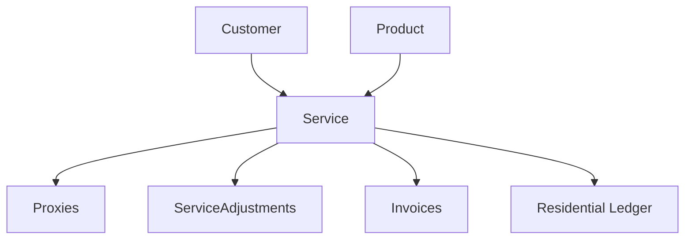

The Service object represents a subscription to a proxy product in the Ping Proxies system. It contains essential information about a purchased proxy service including its type, status, billing details, and associated resources.

## Key Attributes

| Attribute | Type | Description |
|-----------|------|-------------|
| `service_id` | string | Unique identifier for the service |
| `service_name` | string | Name of the purchased service |
| `service_type` | string | Type of service (datacenter, isp, residential, off_catalog) |
| `service_protocol` | string | IP protocol of the service (ipv4, ipv6, dual) |
| `service_quantity` | integer | Number of proxies in the service |
| `service_status` | string | Current status of the service |
| `service_cycle` | string | Billing cycle of the service (e.g., "1:month") |
| `service_expiry_datetime` | datetime | When the current billing period ends |
| `service_total` | integer | Cost of the service in cents |
| `service_is_automatic_collection` | boolean | Whether billing occurs automatically |
| `service_is_pending_cancellation` | boolean | Whether the service is scheduled to be canceled |
| `service_metadata` | object | Custom metadata for tracking and organization |
| `country_id` | string | Country code where the service is based |
| `service_fulfillment_filter` | object | Criteria used when provisioning the service |

## Service Status Values

| Status | Description |
|--------|-------------|
| `awaiting_fulfillment` | Service has been paid for but proxies not yet provisioned |
| `awaiting_manual_fulfillment` | Service needs manual intervention by staff |
| `awaiting_additional_fulfillment` | Service needs more proxies to be provisioned |
| `active` | Service is active and available for use |
| `paused` | Service is temporarily paused |
| `overdue` | Payment is overdue for the service |
| `canceled` | Service has been terminated |
| `complete` | Service has completed its term (for non-recurring services) |

## Object Relationships

The Service object is connected to several other objects in the Ping Proxies API:

- **Customer**: Each service belongs to a customer account
- **Proxies**: Services contain individual proxy objects
- **Service Adjustments**: Track changes or modifications to the service
- **Invoices**: Financial records associated with the service
- **Product**: The product template the service was created from
- **Proxy Users**: Authentication entities that can access the service



## Related Endpoints

| Endpoint | Description |
|----------|-------------|
| `GET /public/user/service/retrieve/{service_id}` | Retrieve a specific service |
| `GET /public/user/service/search` | Search services with filters |
| `PATCH /public/user/service/edit/{service_id}` | Edit a service |
| `DELETE /public/user/service/cancel/{service_id}` | Cancel a service |

## Example Response

```json
{
  "data": {
    "service_id": "API-1234-5678",
    "service_name": "AT&T ISP Proxies [US]",
    "service_type": "isp",
    "service_protocol": "ipv4",
    "service_quantity": 5,
    "service_status": "active",
    "service_cycle": "1:month",
    "service_creation_datetime": "2025-03-25 14:25:36",
    "service_expiry_datetime": "2025-04-25 14:25:36",
    "service_total": 1575,
    "service_is_automatic_collection": true,
    "service_is_pending_cancellation": false,
    "service_metadata": {
      "project": "Client XYZ",
      "department": "Marketing"
    },
    "country_id": "us",
    "service_fulfillment_filter": {
      "asn_id": 7018
    }
  },
  "message": "Service successfully retrieved."
}
```

## Usage Notes

- A service can contain multiple proxies, up to the `service_quantity` value
- The `service_fulfillment_filter` allows you to target specific ASNs or regions
- Services automatically renew based on the `service_cycle` unless `service_is_pending_cancellation` is true
- The `service_metadata` field can be used to organize services by project, client, or department
- When a service is canceled, all associated proxies are deprovisioned
- To view proxies associated with a service, use the `proxies=true` parameter when retrieving the service

## Residential and Mobile Services

Residential and Mobile services have several unique characteristics:

- They do not have static proxies attached to them, unlike datacenter and ISP services
- Instead, they add bandwidth to your account's residential or mobile bandwidth pool
- Bandwidth added through residential/mobile services never expires, even if the subscription is canceled
- Each purchase creates a `residential_ledger` or `mobile_ledger` entry recording the bandwidth addition
- Residential/Mobile services can be paused and unpaused, a feature not available for other service types
- When paused, billing stops but you retain access to any previously purchased bandwidth
- You can access this bandwidth through dynamic residential/mobile proxies using the residential endpoints
