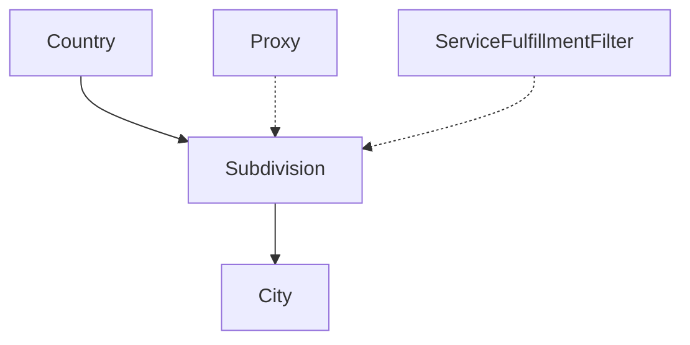

The Subdivision object represents a geographical administrative division within a country in the Ping Proxies system. These are typically states, provinces, regions, or other similar administrative areas. Subdivisions provide a more granular level of geographic targeting than countries alone, allowing you to select proxies from specific regions within countries.

## Key Attributes

| Attribute | Type | Description |
|-----------|------|-------------|
| `subdivision_id` | string | Unique identifier for the subdivision (e.g., `us-tx` for Texas, USA) |
| `subdivision_name` | string | Full name of the subdivision (e.g., `Texas`) |
| `subdivision_alias` | string | Alternative identifier or shorthand (e.g., `us_tx`) |
| `country_id` | string | ISO country code of the parent country (e.g., `us`) |

## Object Relationships

The Subdivision object connects several other entities in the Ping Proxies system:

- **Country**: Each subdivision belongs to a specific country
- **City**: Subdivisions contain multiple cities
- **Proxies**: Proxies can be located within specific subdivisions
- **Service Fulfillment Filters**: Proxy services can be filtered to target specific subdivisions



## Related Endpoints

| Endpoint | Description |
|----------|-------------|
| `GET /public/user/subdivision/retrieve/{subdivision_id}` | Retrieve a specific subdivision |
| `GET /public/user/subdivision/search` | Search subdivisions with filters |
| `GET /public/user/city/search?subdivision_id={subdivision_id}` | Find cities within a specific subdivision |
| `GET /public/user/proxy/search?subdivision_id={subdivision_id}` | Find proxies in a specific subdivision |

## Example Subdivision Object

```json
{
  "subdivision_id": "fr-idf",
  "subdivision_name": "Île-de-France",
  "subdivision_alias": "fr_idf",
  "country_id": "fr"
}
```

## Usage Notes

- When targeting proxies with high geographic precision, subdivisions provide an intermediate level between countries and cities
- The `subdivision_id` follows the ISO 3166-2 format: a country code, followed by a hyphen and the subdivision code
- For service fulfillment filters, using subdivision targeting often provides better proxy availability than city-level targeting while still maintaining geographic specificity
- Not all proxies have subdivision data, particularly in smaller countries
- For residential proxy generation, subdivision targeting is implemented through the `subdivision_id` parameter in the residential list endpoint

## Subdivision ID Formats

Ping Proxies follows the ISO 3166-2 standard for subdivision identification:

- US states: `us-tx`, `us-ca`, `us-ny`, etc.
- Canadian provinces: `ca-on`, `ca-qc`, `ca-bc`, etc.
- UK regions: `gb-eng`, `gb-sct`, `gb-wls`, etc.
- French regions: `fr-idf`, `fr-ara`, `fr-pac`, etc.

This standardized approach ensures consistent identification of subdivisions across the platform.